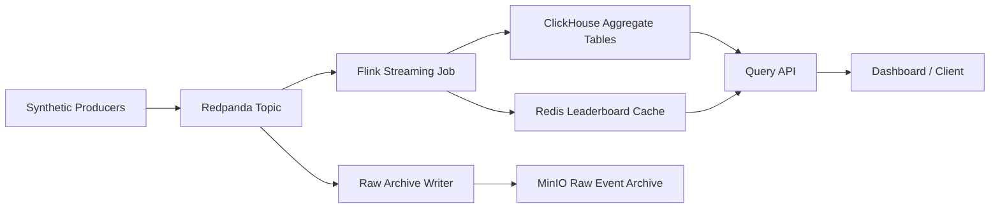

# Architecture

## Purpose
This document is the high-level architecture overview for the real-time ad click analytics system. It defines the system shape, the role of each major component, and the design decisions that anchor the project.

For publication-quality deep dives, see:
- [data-flow.md](/Users/jcpineda/Code/stream-ads-analytics/docs/data-flow.md)
- [deployment.md](/Users/jcpineda/Code/stream-ads-analytics/docs/deployment.md)

## System Goals
- ingest a continuous stream of click events,
- support high logical throughput with skewed traffic,
- compute event-time aggregates and Top-K results,
- provide low-latency reads for dashboards and APIs,
- preserve replayability and operational debuggability.

## Logical Architecture


This diagram shows the logical path from ingestion to serving:
- producers publish click events into a durable log,
- Flink computes stateful stream results,
- ClickHouse stores analytical aggregates,
- Redis accelerates hot leaderboard reads,
- MinIO preserves raw data for replay and debugging.

## Component Responsibilities
### Synthetic producers
- generate click traffic at configurable rates,
- simulate skew, duplicates, and late arrivals,
- publish JSON events to the input topic.

### Redpanda
- act as the durable append-only event log,
- isolate producers from stream-processing and serving sinks,
- provide replay and consumer lag visibility.

### Flink
- parse and validate events,
- assign event-time timestamps and watermarks,
- deduplicate by `click_id`,
- compute windowed aggregates,
- compute Top-K ads and campaigns,
- push results to analytical and cache sinks.

### MinIO
- store raw events or raw partitions for replay and recovery,
- act as the local object-store analogue for cloud archival.

### ClickHouse
- store aggregate tables for analytical queries,
- serve time-window metrics and dimensional breakdowns,
- remain the primary read path for non-hot leaderboard queries.

### Redis
- cache the hottest leaderboard queries,
- provide low-latency reads for current Top-K endpoints.

### Query API
- expose a simple HTTP surface for dashboards and tests,
- read aggregate metrics from ClickHouse,
- read hot leaderboard data from Redis.

## Detailed Views
The architecture is easier to explain when split into two narratives:

### Data flow
The system has three distinct paths:
- ingestion and durable capture,
- stream processing and stateful aggregation,
- low-latency serving and replay.

See [data-flow.md](/Users/jcpineda/Code/stream-ads-analytics/docs/data-flow.md) for the full event lifecycle, processing stages, replay path, and reader-facing diagrams.

### Deployment
The system also has two distinct deployment perspectives:
- a local Docker Compose topology for development,
- a production-style logical topology for article and interview discussion.

See [deployment.md](/Users/jcpineda/Code/stream-ads-analytics/docs/deployment.md) for node boundaries, service placement, network zones, and rollout guidance.

## Partitioning Strategy
### Input topic partitioning
Default choice:
- partition the input topic by `campaign_id`

Why:
- it keeps many campaign-level aggregates local to a partition,
- it is easy to reason about,
- it gives us a natural way to test skew.

Tradeoff:
- a very hot campaign can create imbalance.

Planned extension:
- test salting or two-stage aggregation when a single campaign dominates throughput.

### Stream keys
Early stream keys:
- dedupe keyed by `click_id`
- aggregate keyed by composite dimension keys such as:
  - `campaign_id + window`
  - `ad_id + country + window`

## Flink Job Topology
The first job will likely evolve through these internal stages:

```text
source
  -> parse / validate
  -> assign timestamps + watermarks
  -> dedupe by click_id
  -> aggregate by campaign_id over 1-minute tumbling window
  -> sink to ClickHouse
```

Later stages:
- add 5-minute and 1-hour windows,
- add per-ad and per-country aggregates,
- add Top-K ranking operators,
- add side outputs for very late events.

## Storage Design
### Raw events
- stored in MinIO for replay and debugging,
- object naming should include date, hour, and partition to make replay manageable.

### Aggregates
ClickHouse tables should eventually separate:
- campaign window aggregates,
- ad window aggregates,
- Top-K snapshots or ranking tables.

### Cache
Redis should store:
- current leaderboard payloads,
- short TTL cached responses for hot endpoints.

## Correctness Model
Initial correctness target:
- at-least-once ingestion,
- deterministic dedupe in Flink state,
- replay-safe aggregate rebuilds at the system level.

We are intentionally not promising full exactly-once end-to-end semantics in v1. That tradeoff keeps the project practical while still exercising the important failure and state-management problems.

## Failure and Recovery Boundaries
### Producer failure
- acceptable to lose an in-memory synthetic producer instance,
- source of truth remains the event log once a message is acknowledged by Redpanda.

### Flink restart
- recovery should restore from checkpoints,
- replay from Redpanda offsets should rebuild uncommitted work.

### Sink slowdown
- lag should become visible in consumer metrics and Flink backpressure,
- the event log should buffer short-term sink slowness.

### Logic bug or schema issue
- replay from MinIO or retained Redpanda data should allow state rebuild.

## Major Design Tradeoffs
### Redpanda instead of Kafka for local development
- simpler single-binary operational feel,
- Kafka-compatible enough for the learning goals,
- lower local friction.

### Flink instead of hand-rolled consumers
- forces practice with real stream-processing primitives,
- gives checkpointing and event-time support out of the box,
- maps well to production patterns used at larger companies.

### ClickHouse instead of Postgres
- better fit for analytical aggregations and time-series scans,
- more credible for the read patterns this project needs.

### Redis only for hot reads
- keeps the cache role narrow and easy to explain,
- avoids overcomplicating the serving story.

## Milestone 0 Exit Criteria
Milestone 0 is complete when:
- the scenario and scope are documented,
- the event contract is documented,
- the architecture is documented with diagrams,
- the stack choice and rationale are explicit,
- Milestone 1 infra work is decomposed into concrete tasks.
