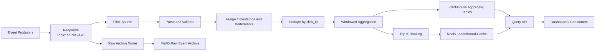
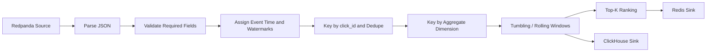
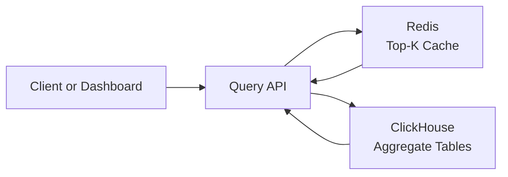
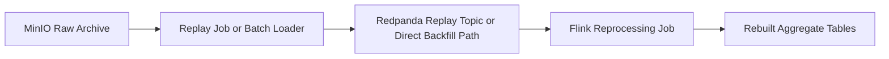

# Data Flow

## Purpose
This document explains how data moves through the system from event creation to user-facing query results. It is written to be readable both as internal engineering documentation and as a publishable article section.

## Why This Flow Matters
The project is intentionally designed around the hardest parts of streaming systems:
- durable ingestion,
- stateful processing,
- replayable correctness,
- low-latency serving,
- resilience to duplicates, skew, and late data.

The data flow is the clearest way to tell that story.

## End-To-End Narrative
At a high level, the system does five things:
1. capture click events durably,
2. process them in event time,
3. maintain streaming state for dedupe and aggregation,
4. persist queryable aggregate views,
5. preserve raw data for replay and recovery.

## End-To-End Flow Diagram

## Event Lifecycle
### 1. Event production
Synthetic producers generate events with:
- a stable `click_id`,
- an `event_time` used for analytics correctness,
- an `ingest_time` used for freshness and debugging,
- business dimensions such as `campaign_id`, `ad_id`, `country`, and `device_type`.

The producers are not just traffic generators. They are also tools for modeling real streaming pain:
- hot campaigns,
- duplicate sends,
- delayed delivery,
- bursty traffic.

### 2. Durable ingest into Redpanda
Every click first lands in Redpanda. This is the system’s operational buffer and replay boundary.

Why this matters:
- producers and consumers are decoupled,
- downstream failures do not immediately lose events,
- consumer lag becomes measurable,
- historical reprocessing becomes possible.

Default partitioning choice:
- partition by `campaign_id`

Why:
- it keeps many first-order aggregates naturally aligned,
- it makes hot-key behavior visible early,
- it is easy to reason about in an article or interview.

## Processing Pipeline
### Processing stages
The Flink job should be explained as a series of transformations rather than one opaque black box.

### 3. Parse and validate
The first stage converts incoming JSON into a typed event model and rejects malformed data.

This is where the job should eventually:
- track invalid event counts,
- surface schema mismatches,
- route severe failures to a dead-letter path if needed.

### 4. Assign timestamps and watermarks
This stage tells Flink to reason in event time, not in arrival time.

That enables:
- correct window placement for out-of-order events,
- bounded late-event handling,
- realistic freshness and completeness tradeoffs.

### 5. Dedupe by `click_id`
The dedupe stage protects downstream aggregates from:
- producer retries,
- replayed messages,
- accidental duplicate generation during tests.

This is one of the most important educational stages in the system because it turns a naive counter into a correctness-aware streaming pipeline.

### 6. Windowed aggregation
After dedupe, the stream is regrouped by the dimensions needed for analytics:
- campaign,
- ad,
- country,
- device type,
- time window.

Typical outputs:
- clicks per campaign per minute,
- clicks per ad per 5 minutes,
- spend per country per hour.

### 7. Top-K ranking
Top-K is conceptually a second-order operation over the aggregated stream:
- first compute counts,
- then rank the hottest keys in each window.

This is where the system starts to look like a real trending engine rather than a generic metrics pipeline.

## Serving Flow
The serving layer should remain simple and intentional:
- ClickHouse is the source for analytical reads,
- Redis is the fast path for the hottest leaderboard requests,
- the Query API hides the storage split from clients.

### Why split serving between ClickHouse and Redis
ClickHouse is excellent for:
- grouped scans,
- time-series slices,
- dimensional analytics.

Redis is excellent for:
- tiny hot payloads,
- repeated leaderboard reads,
- low-latency current-window lookups.

That split gives the system a more realistic read architecture without making it overly complicated.

## Replay Flow
Replay is not an afterthought in this project. It is part of the core learning objective.

Replay supports:
- recovering from logic bugs,
- rebuilding aggregates after schema evolution,
- validating dedupe behavior,
- comparing old and new pipeline versions.

## Failure and Backpressure Story
One good article-quality way to describe the system is by what happens under stress:

### If producers spike
- Redpanda absorbs bursts up to retention and partition capacity limits.

### If Flink slows down
- consumer lag grows,
- checkpoints may lengthen,
- downstream freshness degrades before data is lost.

### If ClickHouse or Redis stalls
- Flink backpressure reveals the issue,
- the event log provides time to recover,
- replay remains available if partial results need rebuilding.

This is the operational value of separating:
- the durable log,
- the stateful compute layer,
- the serving stores.

## Design Principles Captured In The Flow
- write once to a durable log before doing expensive work
- process in event time rather than arrival time
- treat dedupe as a first-class stage
- separate compute state from reader-facing storage
- make replay part of the architecture, not a rescue plan

## Article-Friendly Summary
If you want a short narrative for a blog post, this is the clean version:

The system captures every click in a durable log, processes it in event time with Flink, removes duplicates, computes windowed aggregates and Top-K rankings, stores analytical results in ClickHouse, caches hot leaderboards in Redis, and preserves raw data in MinIO so the entire pipeline can be replayed when logic or schema changes.
