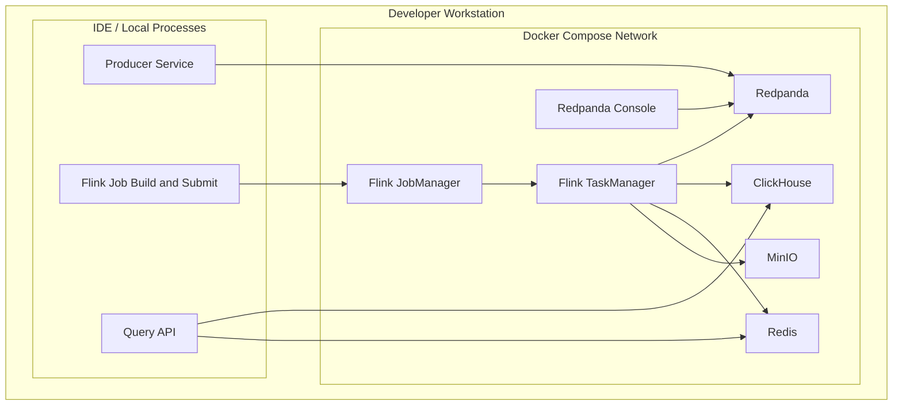
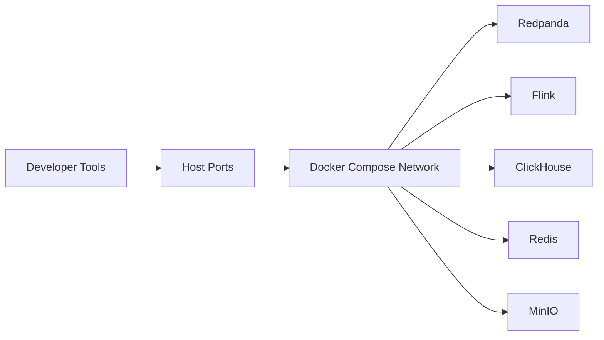
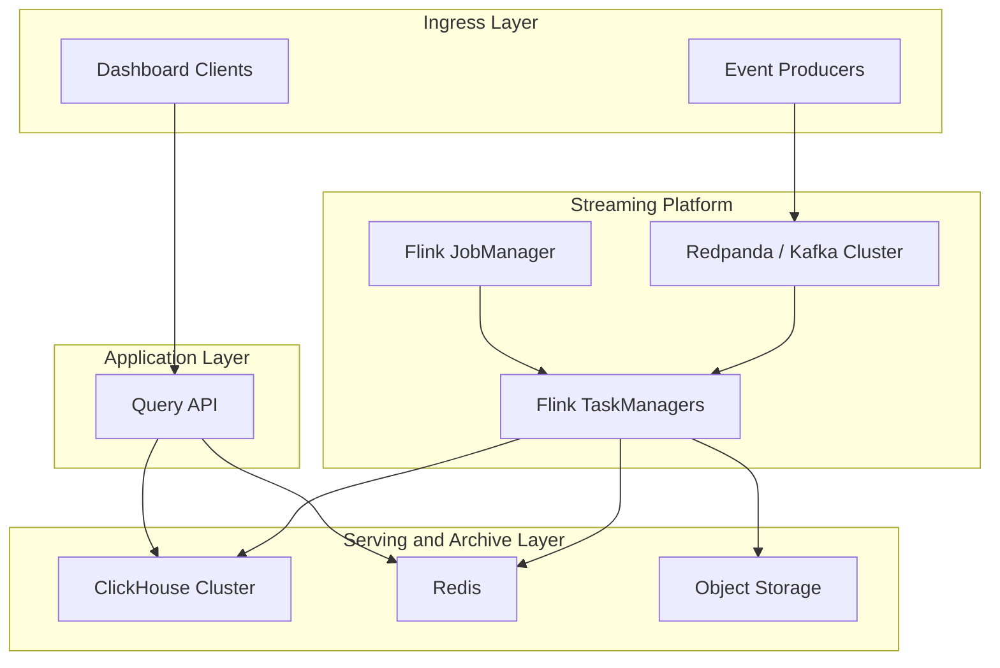

# Deployment

## Purpose
This document explains how the system is deployed for development today and how the same architecture maps to a more production-like topology. It is intended to be readable as both engineering documentation and an article-ready deployment section.

## Deployment Philosophy
This project uses a deliberately staged deployment model:
- local development should be easy to run and debug,
- the topology should still resemble a real streaming platform,
- the architecture should scale conceptually to a production discussion.

That is why the deployment story is split into:
- a local Docker Compose layout,
- a production-style logical deployment model.

## Local Development Deployment
For early milestones, infrastructure runs in containers while application code runs directly from the host machine or IDE.

### Local deployment diagram

### Why this layout works well early
- infrastructure is reproducible through one Compose file,
- developers can iterate on code without rebuilding containers,
- service boundaries remain visible,
- logs and UIs remain easy to inspect.

### Local service responsibilities
#### Redpanda
- local durable event log,
- replay boundary,
- topic administration surface.

#### Flink JobManager and TaskManager
- local stream runtime,
- operator graph execution,
- checkpoint orchestration.

#### ClickHouse
- local analytical read store for aggregate tables.

#### Redis
- local fast cache for Top-K results.

#### MinIO
- local S3-compatible storage for raw archive and replay experiments.

## Local Network And Access Model
The local stack should be described in simple zones:

Key idea:
- host-based app code talks to infrastructure through published ports,
- containers talk to each other over the private Compose network.

This separation matters because it mirrors real deployment boundaries:
- external clients use published endpoints,
- internal service-to-service traffic stays inside the cluster network.

## Local Runtime Boundaries
The cleanest operational boundary for this project is:
- infra in Docker,
- app code on the host.

That gives you:
- faster inner-loop development,
- easier debugging in the IDE,
- fewer moving parts before the first data path works.

Later, if desired, the producer and query API can also move into containers without changing the conceptual architecture.

## Production-Style Logical Deployment
For an article or interview, it helps to show how the same design scales conceptually beyond Docker Compose.

### Production-style deployment diagram

## Scaling Model By Layer
### Event log layer
Scale by:
- increasing partitions,
- adding brokers,
- tuning retention and replication.

Primary concern:
- hot partitions from skewed `campaign_id` traffic.

### Stream processing layer
Scale by:
- adding TaskManagers,
- increasing parallelism,
- repartitioning or salting hot keys,
- tuning checkpoint and state settings.

Primary concern:
- state growth and backpressure.

### Serving layer
Scale by:
- widening ClickHouse capacity for reads and inserts,
- keeping Redis focused on hot, small responses,
- pushing broader analytics to ClickHouse rather than cache.

Primary concern:
- preserving freshness without coupling query latency to stream state directly.

## Fault Domains
A good deployment story also explains what can fail independently.

### Durable ingest domain
Redpanda can absorb transient downstream issues without immediately dropping events.

### Compute domain
Flink failures should recover through checkpoints and offset tracking.

### Serving domain
Query serving can degrade independently of ingestion as long as the stream layer continues to process and persist results.

### Archive domain
Raw archive storage remains the safety net for backfills and logic corrections.

This separation is one of the strongest architectural qualities of the project because it prevents every failure from becoming a full-system outage.

## Rollout Path
The deployment evolution can be described in four steps:

1. local infra in Docker Compose with host-run app code
2. end-to-end pipeline working locally
3. app services containerized if needed
4. production-style deployment on orchestrated infrastructure

That path is realistic and easy to explain in an article because it mirrors how many real systems mature:
- first prove the shape,
- then stabilize operations,
- then formalize deployment.

## Operational Interfaces
The most useful interfaces to expose in the deployment story are:
- Redpanda broker endpoint
- Redpanda Console UI
- Flink UI
- ClickHouse HTTP and native ports
- Redis port
- MinIO API and console
- Query API endpoint

These endpoints make the system feel concrete and runnable, which helps both readers and future collaborators.

## Article-Friendly Summary
For development, the platform runs as a Docker Compose stack with Redpanda, Flink, ClickHouse, Redis, and MinIO, while application code runs directly from the host for fast iteration. For a production-style deployment, the same architecture maps cleanly into separate ingest, stream-processing, serving, and archive layers, each of which can scale and fail independently.
